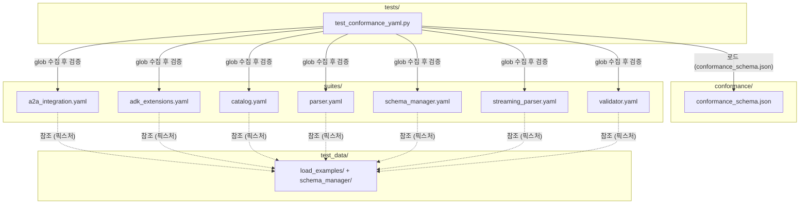

# agent_sdks/conformance 코드맵

## 패키지 개요

**패키지명**: `a2ui-conformance-validation`  
**버전**: `0.1.0`  
**설정 파일**: `pyproject.toml`  
**역할**: A2UI conformance 테스트 파일(`suites/*.yaml`)이 `conformance_schema.json`에 정의된 JSON Schema를 만족하는지 검증하는 내부 유효성 검사 패키지. SDK가 아닌 저장소 내부 검증 전용 도구이다.  
**Python 최소 버전**: `>=3.10`

---

## 디렉토리 구조 요약

```
agent_sdks/conformance/
├── conformance_schema.json   # conformance YAML 파일들의 구조를 정의하는 JSON Schema
├── pyproject.toml            # 패키지 메타데이터 및 의존성 선언
├── uv.lock                   # uv 패키지 매니저 락 파일
├── README.md                 # 패키지 설명 문서
├── suites/                   # 검증 대상 conformance YAML 파일 모음
│   ├── a2a_integration.yaml
│   ├── adk_extensions.yaml
│   ├── catalog.yaml
│   ├── parser.yaml
│   ├── schema_manager.yaml
│   ├── streaming_parser.yaml
│   └── validator.yaml
├── test_data/                # 테스트에서 참조하는 픽스처 JSON 데이터
│   ├── load_examples/        # 예제 로드 동작 검증용 다양한 JSON 픽스처
│   └── schema_manager/      # schema_manager 관련 JSON 픽스처
└── tests/                    # pytest 테스트 모듈
    └── test_conformance_yaml.py
```

| 하위 디렉토리 | 책임 |
|---|---|
| `suites/` | SDK 구현체가 준수해야 할 conformance 시나리오를 YAML로 기술한 파일들. 각 파일은 `conformance_schema.json`을 따라야 한다. |
| `test_data/` | `suites/` YAML 내에서 참조되거나 conformance 테스트 실행 시 입력으로 사용하는 JSON 픽스처 파일 모음. |
| `tests/` | `suites/*.yaml`이 스키마를 준수하는지 자동 검증하는 pytest 테스트 모듈. |

---

## 내부 의존성 그래프



---

## 파일 인덱스

| 파일 | 역할 |
|---|---|
| [tests/test_conformance_yaml.py](tests/test_conformance_yaml.py.md) | `conformance/suites/` 디렉터리의 모든 YAML 파일이 `conformance_schema.json`에 정의된 JSON Schema를 만족하는지 파라미터화된 pytest 테스트로 검증하는 모듈 |
| `conformance_schema.json` | `suites/*.yaml` 파일의 구조적 유효성을 정의하는 JSON Schema |
| `pyproject.toml` | 패키지 이름·버전·의존성·pytest 설정을 선언하는 프로젝트 설정 파일 |
| `suites/a2a_integration.yaml` | A2A 통합 관련 conformance 시나리오 정의 |
| `suites/adk_extensions.yaml` | ADK 확장 관련 conformance 시나리오 정의 |
| `suites/catalog.yaml` | catalog 기능 관련 conformance 시나리오 정의 |
| `suites/parser.yaml` | 파서 관련 conformance 시나리오 정의 |
| `suites/schema_manager.yaml` | 스키마 매니저 관련 conformance 시나리오 정의 |
| `suites/streaming_parser.yaml` | 스트리밍 파서 관련 conformance 시나리오 정의 |
| `suites/validator.yaml` | 유효성 검증기 관련 conformance 시나리오 정의 |
| `test_data/` | conformance YAML에서 참조하는 JSON 픽스처 파일 모음 |
| `uv.lock` | uv 패키지 매니저 재현 가능한 빌드를 위한 락 파일 |

---

## 주요 진입점 및 외부 의존성

### 진입점

- **테스트 실행**: `pytest` 명령을 저장소 루트 또는 `agent_sdks/conformance/` 디렉토리에서 실행하면 `tests/test_conformance_yaml.py`가 자동으로 수집된다.
- **테스트 함수**: `test_validate_conformance_yaml` — `suites/*.yaml` 파일 각각에 대해 하나의 pytest 케이스로 파라미터화되어 실행된다.

### 외부 의존성

| 패키지 | 버전 제약 | 용도 |
|---|---|---|
| `pytest` | `>=9.0.2` | 테스트 프레임워크, 파라미터화 실행 |
| `jsonschema` | `>=4.0.0` | JSON Schema 기반 YAML 데이터 유효성 검증 |
| `pyyaml` | `>=6.0.1` | YAML 파일 파싱 (`yaml.safe_load`) |

표준 라이브러리(`os`, `json`, `glob`)도 사용되며 별도 설치는 불필요하다.  
저장소 내부 다른 모듈에 대한 의존성은 없다.
